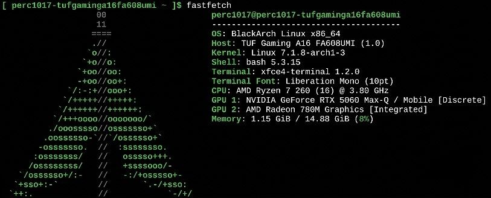

<table>
<tr>
<td width="70%">

$\Large{\color{green}{ Hi \ there, \ I \ 'm \  Mihail}}$

Passionate about cybersecurity and ethical hacking, I thrive on uncovering vulnerabilities, hacking boxes, and hardening infrastructure. With hands-on experience in tools like Metasploit and Burp Suite, combined with a strong DevOps foundation, I'm on a mission to bridge the gap between development and offensive security.

- 🎯 Currently working as **Junior DevSecOps Engineer & Penetration Tester**
- 💬 Ask me about: **Ethical Hacking & Pentesting** (Metasploit, Burp Suite), **Vulnerability Assessment** (Nessus, OpenVAS), **Network Architecture & Routing** (Cisco CCNA, Packet Tracer), and automating containerized environments using **Docker & Kubernetes**
- 📍 Based in: **Ukraine** 🇺🇦
- 📫 Reach me: [perc1017mail@gmail.com](mailto:perc1017mail@gmail.com)
- ⚡ Fun fact: I once solved an entire Capture The Flag challenge in under an hour — talk about a rush!

</td>
<td width="30%" align="center">

</td>
</tr>
</table>

---

$\huge{\color{green}{Tech \  skills \ and \ tools}}$

$$\color{green}{\texttt{ OFFENSIVE\ SECURITY}}$$

$$\color{green}{\texttt{\ DEVOPS\ \ AND \ INFRASTRUCTURE}}$$

$$\color{green}{\texttt{\ CLOUDS\ \ AND \ OS}}$$

$$\color{green}{\texttt{ PROGRAMMING}}$$

